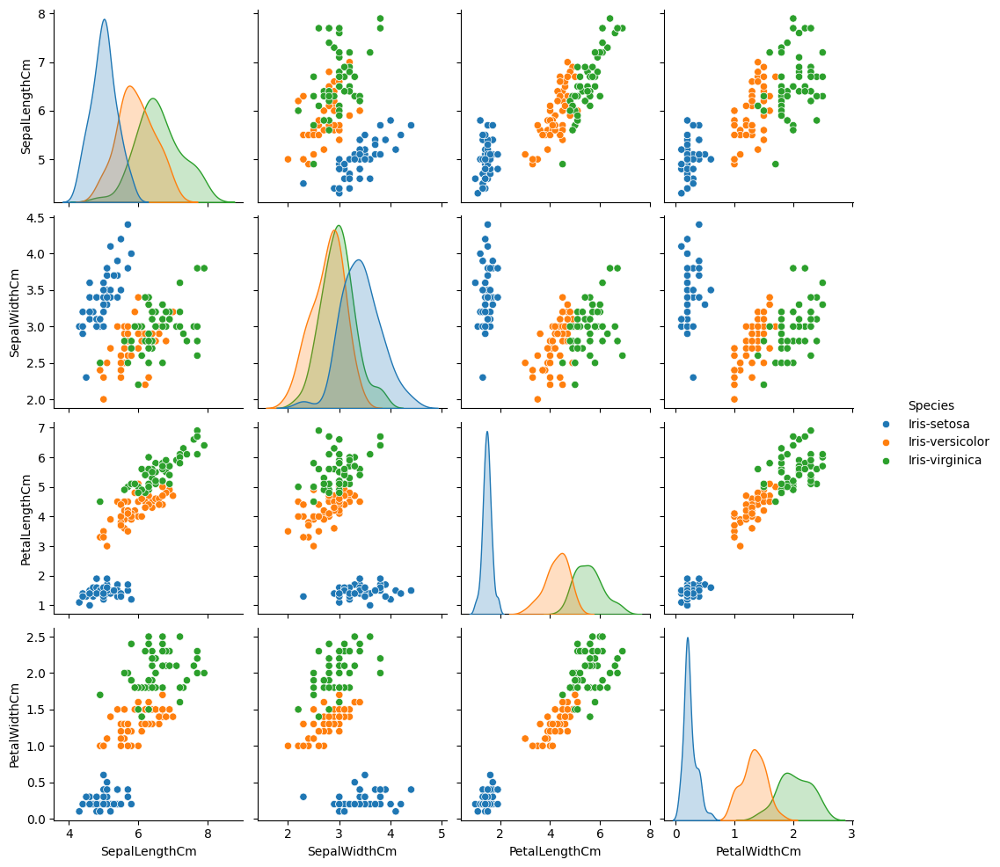

# 🌸 Iris Flower Classification

This project demonstrates the application of supervised machine learning to classify iris flowers into one of three species based on physical measurements.

---

## 🎯 Task Objectives

✔️ Use measurements of Iris flowers (*setosa*, *versicolor*, *virginica*) as input data  
---

## 📘 Dataset Overview

The dataset consists of 150 samples with 4 features:
- `SepalLengthCm`
- `SepalWidthCm`
- `PetalLengthCm`
- `PetalWidthCm`

The target variable is `Species`, which includes:
- *Iris-setosa*
- *Iris-versicolor*
- *Iris-virginica*

Dataset Link: https://www.kaggle.com/datasets/saurabh00007/iriscsv

---

## 📊 Result

We used Seaborn's `pairplot` to visualize feature relationships, colored by species:

- ✅ *Iris-setosa* is clearly distinguishable from the others
- ⚠️ Some overlap exists between *versicolor* and *virginica*
- ⭐ Petal features (length & width) offer the **best class separation**

  

